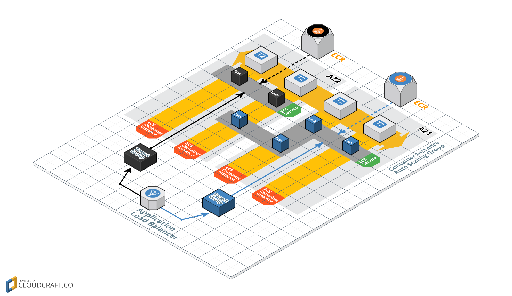
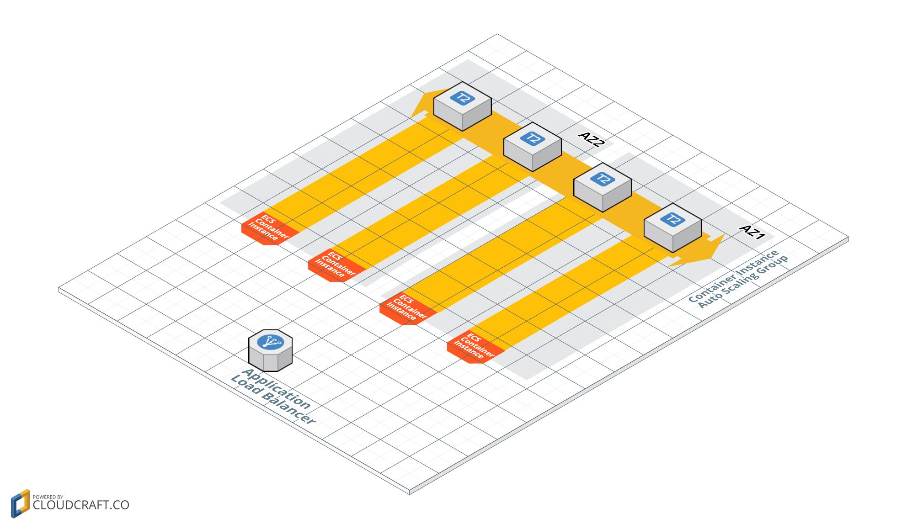
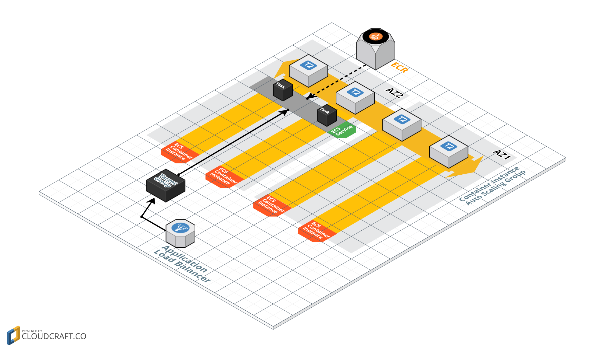
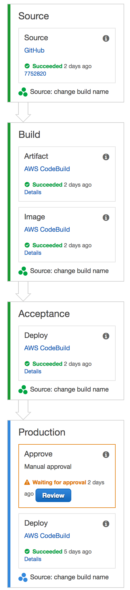

[](https://circleci.com/gh/stelligent/mu) [](https://gitter.im/stelligent/mu?utm_source=badge&utm_medium=badge&utm_campaign=pr-badge&utm_content=badge) [](https://goreportcard.com/report/github.com/stelligent/mu)


# Why?
Amazon ECS (EC2 Container Service) provides an excellent platform for deploying microservices as containers.  The challenge however is that there is a significant learning curve for microservice developers to deploy their applications in an efficient manner.  Specifically, they must learn to use CloudFormation to orchestrate the management of ECS, ECR, EC2, ELB, VPC, and IAM resources.  Additionally, tools like CodeBuild and CodePipeline must be mastered to create a continuous delivery pipeline for their microservices.

To address these challenges, this tool was created to simplify the declaration and administration of the AWS resources necessary to support microservices.  Similar to how the [Serverless Framework](https://serverless.com/) improved the developer experience of Lambda and API Gateway, this tool makes it easier for developers to use ECS as a microservices platform.

The `mu` tool uses CloudFormation stacks to manage all resources it creates.  Additionally, `mu` will not create any databases or other AWS resources to support itself.  It will only create resources (via CloudFormation) necessary to run your microservices.  This means at any point you can stop using `mu` and continue to manage the AWS resources that it created via AWS tools such as the CLI or the console.



# Installation

```bash
# Install latest version to /usr/local/bin
curl -s https://raw.githubusercontent.com/stelligent/mu/master/install.sh | sh

# Install v0.1.0 version to ~/bin
curl -s https://raw.githubusercontent.com/stelligent/mu/master/install.sh | INSTALL_VERSION=0.1.0 INSTALL_DIR=~/bin sh
```

# Environments
Environments are defined to become a target for deploying services to.  Each environment is a CloudFormation stack consisting of the following resources:

* **VPC** – To provide the network infrastructure to launch the ECS container instances into. Optionally, you can target an existing VPC.
* **ECS Cluster** – The cluster that the services will be deployed into.
* **Auto Scaling Group** – To manage the ECS container instances that contain the compute resources for running the containers.  Auto scaling policies will be defined based on memory entitlements in the cluster.
* **Application Load Balancer** – To provide load balancing for the microservices running in containers.



## Configuration
```
---

### Define a list of environments
environments:

  # The unique name of the environment  (required)
  - name: dev


    ### Attributes for the ECS container instances
    cluster:
      imageId: ami-xxxxxx           # The AMI to use for the ECS container instances (default: latest ECS optimized AMI)
      instanceType: t2.micro        # The instance type to use for the ECS container instances (default: t2.micro)
      instanceTenancy: default      # Whether to use default or dedicated tenancy (default: default)
      desiredCapacity: 1            # Desired number of ECS container instances (default 1)
      maxSize: 2                    # Max size to scale the ECS ASG to (default: 2)
      keyName: my-keypair           # name of EC2 keypair to associate with ECS container instances. Launches bastion host if defined. (default: none)
      sshAllow: 0.0.0.0/0           # CIDR block to allow SSH access from (default: 0.0.0.0/0)
      httpProxy: 10.0.0.43:8080     # Host and port to use for HTTP proxy for yum, docker images, and ECS (default: none)
      scaleOutThreshold: 80         # Threshold for % memory utilization to scale out ECS container instances (default: 80)
      scaleInThreshold: 30          # Threshold for % memory utilization to scale in ECS container instances (default: 30)

    ### Attributes for the ELB
    loadBalancer:
      internal: true                # Whether to create an internal ELB or not (default: false)
      hostedzone: mydomain.com      # HostedZone in Route53 to create ELB DNS for.  Leave blank to not create DNS (default: none)
      name: api                     # Name to register in hostedzone for ELB DNS.  (default: environment name)
      certificate: arn:aws:acm:...  # The ARN of a certificate in ACM.  If defined, will create HTTPS listener in ELB.  (default: none)

    ### Attributes for the VPC to target.  If not defined, a VPC will be created. (default: none)
    vpcTarget:
        vpcId: vpc-xxxxx            # The id of the VPC to launch ECS container instances into
        ecsSubnetIds:               # The list of subnets to use for ECS container instances
          - subnet-xxxxx
          - subnet-xxxxy
          - subnet-xxxxz
        elbSubnetIds:               # The list of subnets to use for ELBs
          - subnet-xxxxx
          - subnet-xxxxy
          - subnet-xxxxz
```

## Commands
```
# List all environments
> mu env list

# Show details about a specific environment (ECS container instances, Running services, etc)
> mu env show <environment_name>

# Upsert an environment
> mu env up <environment_name>

# Terminate an environment
> mu env terminate <environment_name>
```

# Services
Services are first pushed to an ECR repository and then deployed to a specific environment.  Each service is a CloudFormation stack consisting of the following resources:

* **Task Definition** – An ECS task definition referencing the image and tag in the ECR repo.
* **Service** - An ECS service referencing the Task Definition.
* **Target Group** - An ALB target group for the Service to reference and register containers in.
* **Listener Rule** - A rule in the ALB listener from the environment to route specific URLs to the target group.



## Configuration
```
---

### Define the service for this repo
service:
  name: my-service                   # The unique name of the service (default: the name of the directory that mu.yml was in)
  desiredCount: 4                    # The desired number of tasks to run for the service (default: 2)
  dockerfile: ./Dockerfile           # The relative path to the Dockerfile to build images (default: ./Dockerfile)
  imageRepository: tutum/hello-world # The repository to push images to and deploy services from.  Leave unset to have mu manage an ECR repository (default: none)
  port: 80                           # The port to expose from the container (default: 8080)
  healthEndpoint: /health            # The endpoint inside the container to determine if the task is healthy (default: /health)
  cpu: 20                            # The number of CPU units to allocate to each task (default: 10)
  memory: 400                        # The amount of memory in MiB to allocate to each task (default: 300)

  # The paths to match on in the ALB and route to this service.  Leave blank to not create an ALB target group for this service (default: none)
  pathPatterns:
    - /bananas
    - /apples

  # The priority for resolving the pathPatterns from the ALB (between 1 and 99999)
  priority: 25

  # Environment variables
  environment:
    DB_TYPE: mysql                  # Define an environment variable for all environments by have a string for value
    DB_URL:                         # Define an different value per environment by have a map for value
        dev:  10.0.0.1:3306
        prod: 10.0.100.5:3306

```

## Commands
```
# Show details about a specific service (Which versions in which environments, pipeline status)
> mu service show [<service_name>]

# Build docker image and push to ECR
> mu service push

# Deploy the service to an environment
> mu service deploy <environment_name>

# Undeploy the service from an environment
> mu service undeploy <environment_name> [<service_name>]
```

# Pipelines
A pipeline can be created for each service that consists of the following steps:

* **Source** - Retrieve source from GitHub for a specific branch.  Triggered on each commit.
* **Build Artifact** - Compile the source code via CodeBuild and a `buildspec.yml`.
* **Build Image** - Build the Docker image and push to ECR repository.
* **Acceptance** - Deploy to acceptance environment and run automated tests.
* **Production** - Wait for manual approval, then deploy to production environment.

<a href="docs/ms-pipeline-1.png"></a>


## Configuration
```
---
service:

  name: my-service
  # ... service config goes here ...

  # Define the behavior of the pipeline
  pipeline:
      source:
        repo: stelligent/microservice-exemplar  # The GitHub repo slug to build (default: none)
        branch: mu                              # The branch to build from (default: master)
      build:
        image: aws/codebuild/java:openjdk-8     # The image to use for CodeBuild job (default: aws/codebuild/ubuntu-base:latest)
        type: linuxContainer
        computeType: BUILD_GENERAL1_SMALL       # The type of compute instance for builds (default: BUILD_GENERAL1_SMALL)
      acceptance:
        environment: dev                        # The environment name to deploy to for testing (default: dev)
        image: aws/codebuild/java:openjdk-8     # The image to use for CodeBuild test job (default: aws/codebuild/ubuntu-base:latest)
        type: linuxContainer
        computeType: BUILD_GENERAL1_SMALL       # The type of compute instance for testing builds (default: BUILD_GENERAL1_SMALL)
      production:
        environment: production                 # The environment name to deploy to for production (default: production)
```

## Commands
```
# List the pipelines
> mu pipeline list

# Upsert the pipeline
> mu pipeline up [-t <repo_token>]

# Terminate the pipeline
> mu pipeline terminate [<service_name>]
```

# Common flags
```
# Path to mu config
> mu -c path/to/mu.yml ...

# AWS region
> mu -r us-west-2 ...

# or via environment variable
> AWS_REGION=us-west-2 mu ...

# AWS profile
> mu -p my-profile ...

# or via environment variable
> AWS_PROFILE=my-profie mu ...

```

# Contributing

Want to contribute to Mu?  Awesome!  Check out the [contributing guidelines](CONTRIBUTING.md) to get involved.

## Building from source

* Install Go tools 1.7+ - (https://golang.org/doc/install)
* Install [Glide](https://github.com/Masterminds/glide) via `curl https://glide.sh/get | sh`
* Clone this repo `git clone git@github.com:stelligent/mu.git $GOPATH/src/github.com/stelligent/mu`
* Go to src `cd $GOPATH/src/github.com/stelligent/mu`
* Build with `make`
